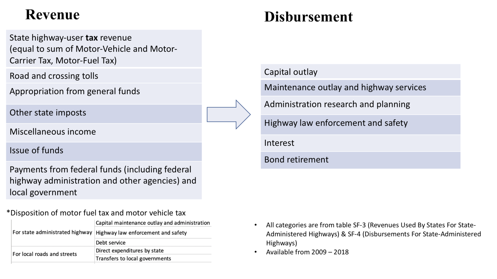
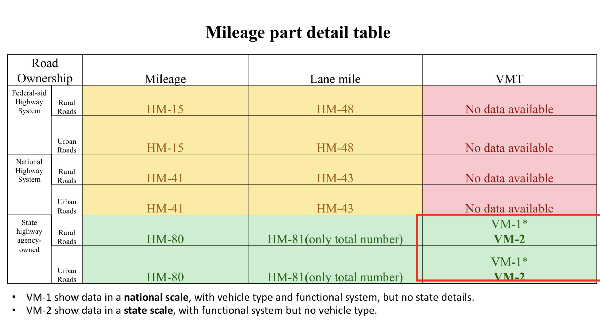
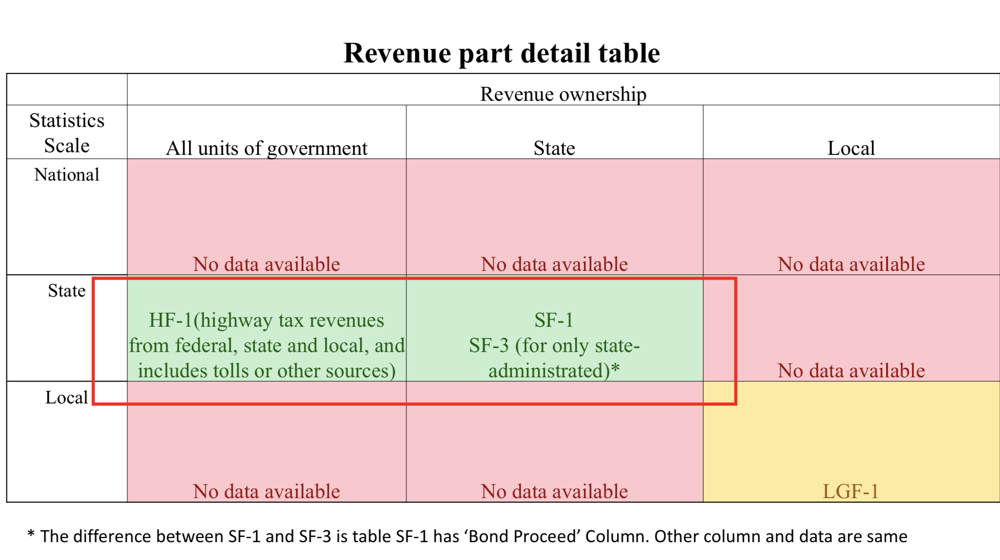
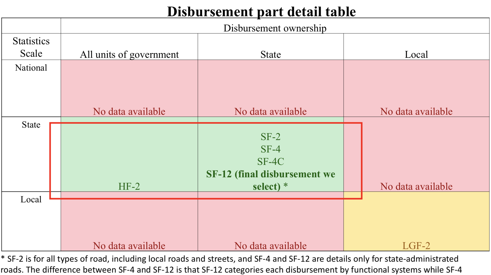
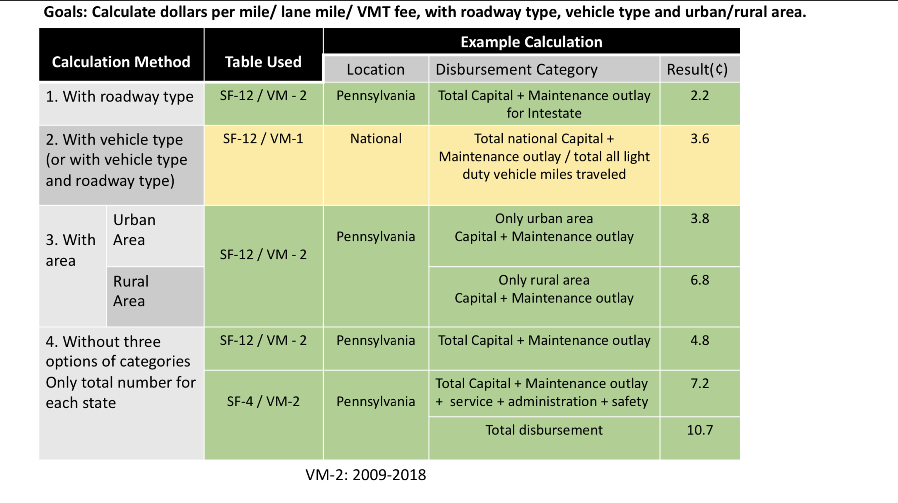

# Data-Challenges-and-Solutions-in-Implementing-Mileage-Based-User-Fees
## 1. File Introduction
Mileage data analysis Report is a 24 pages report about detailed proper MBUF database analysis and relevent database conparison using pie chart, excel spreadsheet etc.

MBUF Summary PPT is a condensed version summary.

Code is relevent code when doing web scrape and data processing and comparison.

## 2. MBUFS Summary Tables:

Conducted an extensive compilation and comparison of database on disbursements, revenue, VMT, miles, etc. Please see more details in Report.

